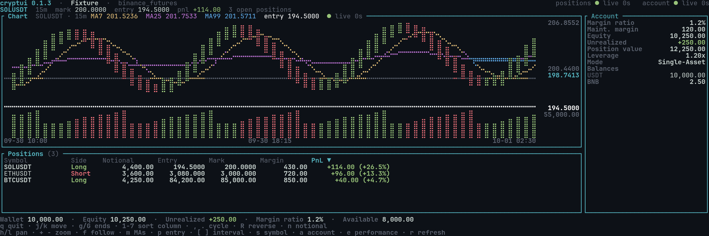

# cryptui

A terminal UI for keeping an eye on several crypto exchange accounts at once,
in the spirit of the dense, panel-based trading terminals of the desktop world.

**Status: v0.1.3 — read-only.** It monitors, it does not trade. Order entry,
the order book and additional venues are planned; the venue layer is already
abstracted behind a trait so a new exchange does not touch UI code.



That is the bundled *fixture* account — three synthetic positions — so it
renders with no network and no credentials. To produce that frame yourself:

```sh
cryptui --account paper --dump-frame --width 118 --height 36 > frame.ans
clear && cat frame.ans
```

## Features

- **Several accounts** from one configuration file, switched at runtime with `a`.
- **Sortable positions table** with live unrealised PnL, colour-coded and
  sortable by symbol, side, size, entry, mark, margin or PnL.
- **Candlestick chart** with MA(7/25/99) overlays, a volume pane, price and time
  axes, intervals from 1m to 1d, pan, zoom and follow mode.
- **Symbol picker** over every tradable contract, not just the ones you hold.
- **Account performance**: `e` opens a full-screen panel with the equity curve
  and the figures that describe it — total return, CAGR, volatility, Sharpe,
  Sortino, max drawdown, Calmar, win rate, best and worst day — over a month,
  three months, a year, or everything on record (`1`–`4`, or `[`/`]`). The curve
  is a performance index, 100 at the start of the window, reconstructed from the
  venue's income records and adjusted for deposits and withdrawals, so money paid
  in does not read as a gain: `◆` marks every point where it moved, and `b` swaps
  the index for the raw wallet balance. Each run records today's balance locally
  so longer windows fill in over time.
- **Account panel** on wide screens: margin ratio, maintenance margin, equity,
  unrealised PnL, position value, actual leverage, the venue's account mode
  (multi-assets or single-asset) and every non-zero balance, in a column beside
  the chart. It is dropped rather than squeezed when the screen cannot also hold
  the whole positions table, where the footer line carries the same summary.
- **Size in contracts or in value**: the size column shows the position value in
  USDT by default, and `n` swaps it to contract amounts. Sorting follows
  whichever unit the column is showing.
- **Toggleable overlays**: `m` shows or hides the moving averages, `p` shows or
  hides the entry-price line of the position being charted, marked on the price
  axis next to the live price. The price range
  widens — within a bounded multiple — so an entry far from the current price
  stays on screen instead of being clipped away.
- **Honest feed health**: each feed reports its age, and says why it failed
  rather than freezing quietly.
- **Offline fixture accounts**, so the UI can be exercised without a second live
  account.


## Install

Requires Rust 1.85 or newer.

```sh
cargo install --git https://github.com/phl3x0r/cryptui
```

## Configure

CryptUI reads its configuration from the first of:

1. `--config <path>`
2. `$CRYPTUI_CONFIG`
3. `~/.config/cryptui/config.toml`

Start from the template in this repository:

```sh
mkdir -p ~/.config/cryptui
cp config.template.toml ~/.config/cryptui/config.toml
chmod 600 ~/.config/cryptui/config.toml
```

Then fill in your credentials:

```toml
default_account = "main"

[settings]
refresh_interval_ms   = 3000
default_interval      = "15m"
chart_history_candles = 500

[accounts.main]
venue      = "binance_futures"
label      = "Main"
api_key    = "${BINANCE_API_KEY}"      # or paste the literal key here
api_secret = "${BINANCE_API_SECRET}"   # or paste the literal secret here
testnet    = false

[accounts.paper]
venue   = "binance_futures"
label   = "Fixture"
fixture = "tests/fixtures/account_paper.json"
```

**API keys.** Read-only keys are enough and are what this release is designed
for: enable *Reading* only, plus futures read access. CryptUI never needs trade
permission. Prefer `${ENV_VAR}` references so the file itself holds no secret;
if you paste literal credentials instead, the file mode is checked and a warning
is logged when it is readable by other users.

**Fixture accounts** read their positions, balances, contracts and candles from
a JSON file instead of the network. `fixture` is resolved relative to the
directory you run `cryptui` from. The bundled
[`tests/fixtures/account_paper.json`](tests/fixtures/account_paper.json) is
synthetic — never record a real account into a repository.

## Keys

| Key | Action |
|---|---|
| `q`, `Esc`, `Ctrl-C` | Quit |
| `j` / `k`, `↓` / `↑` | Move the position selection (the chart follows it) |
| `g` / `G` | First / last position |
| `1` … `7` | Sort by that column; press again to reverse |
| `,` / `.` | Cycle the sort column |
| `R` | Reverse the sort order |
| `h` / `l`, `←` / `→` | Pan the chart into history / back towards now |
| `+` / `-` | Zoom the chart in / out |
| `f` | Follow the newest candle again |
| `m` | Show or hide the moving averages |
| `p` | Show or hide the entry-price line of a held position |
| `n` | Swap the size column between position value and contract amount |
| `e` | Open or close the full-screen account performance panel |
| `1`–`4` | In the panel: window of 1 month, 3 months, 1 year or everything |
| `b` | In the panel: swap the curve between the performance index and the balance |
| `[` / `]` | Longer / shorter candle interval, or the performance window in the panel |
| `s` | Symbol picker (`Enter` picks, `Esc` cancels, typing filters) |
| `a` | Switch to the next configured account |
| `r` | Refresh now |

Inside the symbol picker the global shortcuts are suspended, so `q` filters
rather than quits. Inside the performance panel, `1`–`4`, `[`/`]` and `b` belong
to the panel, and `Esc` closes it rather than quitting; the rest still works.

## Troubleshooting

**Why is the year view empty?** The venue serves only a few months of income
history — on a new account, only since it opened — and exposes no equity history
at all. The curve is therefore reconstructed from income records back to the
oldest one the venue will serve, and today's balance is recorded locally on each
run, so the longer windows fill in as the account ages. The panel states the
coverage it actually has instead of stretching a short series.

**Why does the panel disagree with Binance's own PnL page?** Three things, in
order of size. The venue serves income only for a recent window, so a long view
covers less than the venue's page does. Binance's page also counts unrealised
moves on open positions, which no income record contains. And on a multi-assets
or credits account the PnL settles in an asset that is not the wallet's own: the
`BNFCR` credits of Credits Trading Mode, or BNB commission rebates. Those records
are added at face value rather than converted, which is deliberate: the venue's
wallet total values a credit at about 0.884 USD, but the venue's own PnL
percentages divide the credit amount at par by a USDⓈ equity, so par is the
convention that agrees with the page it gets compared against. The coverage line
names any income asset that is not a dollar stablecoin, and the log records them
for every fetch (`-v`).

**Where do the logs go?** The interactive UI writes to
`$XDG_STATE_HOME/cryptui/cryptui.log` (`~/.local/state/cryptui/cryptui.log` by
default, or `$CRYPTUI_LOG` if set); `-v` / `-vv` raise the level. It cannot log
to the terminal — a line written to stderr lands on top of the rendered frame and
stays there, because ratatui only repaints cells whose contents change. The
headless commands (`--print …`, `--dump-frame`, `--print-config`) log to stderr
as usual, since nothing is drawing there.

**The chart is live but the feed says `stale`.** Check the log file. Positions and
balances are polled every `settings.refresh_interval_ms`; the chart tolerates
silence up to twice its candle interval, because a quiet contract legitimately
goes minutes without a candle update.

**Nothing streams on Binance futures.** Some networks accept the WebSocket
upgrade on `fstream.binance.com` and then never deliver market data, while the
same host's REST API and Binance's spot stream work normally. CryptUI detects a
stream that never delivers anything, logs `market stream stayed silent; polling
instead`, and polls the REST API for the chart instead. PnL freshness then comes
from the normal position poll.

**`HTTP 451` or `403` from the venue.** Binance blocks some regions at the API
level. The error is reported verbatim, including a hint that the network looks
blocked. Use `testnet = true` or a fixture account.

**`environment variable … is not set`.** A `${VAR}` reference in the config has
no matching environment variable. Export it, or replace the reference with the
literal value.

**`account 'main' is incomplete`.** The account has neither a full credential
pair nor a `fixture`. CryptUI refuses to start rather than run unauthenticated.

**The terminal looks broken after a crash.** The terminal is restored on exit
and on panic; if a signal killed the process, run `reset`.

## Development

Scope, decisions and per-phase verification evidence live in `PLAN.md`, which is
intentionally not committed.

```sh
mise install          # Rust toolchain pinned by .mise.toml
cargo fmt --all
cargo clippy --all-targets --all-features -- -D warnings
cargo test --all-features
```

Layout snapshots render into a ratatui test backend, so the UI can be checked
without a terminal. `cargo test` covers chart arithmetic, payload mapping,
configuration validation, key handling, the silent-stream fallback and every
rendered panel.

## Design notes

- **One narrow outcome.** v0.1 answers "what do I hold, and what is it worth?"
  Order placement, the order book and further venues are deliberately absent.
- **The venue is a trait.** `Venue` exposes contracts, positions, balances and
  candles; everything above it is venue-agnostic, and a second exchange only
  needs to implement it.
- **Secrets are a type.** Credentials live in `Secret`, whose `Debug` is
  redacted, and a fixture test asserts no credential material reaches a log.
- **Failures are visible.** Every feed reports its age and its last error; a
  screen that cannot update says so.

## License

MIT — see [LICENSE](LICENSE).
